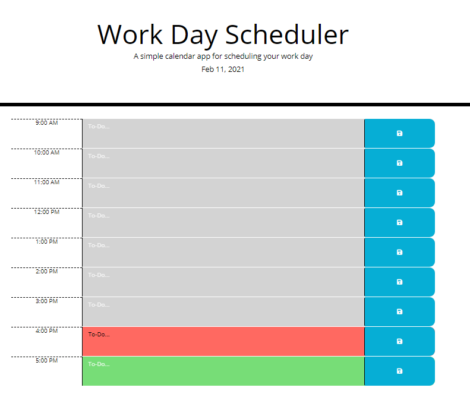
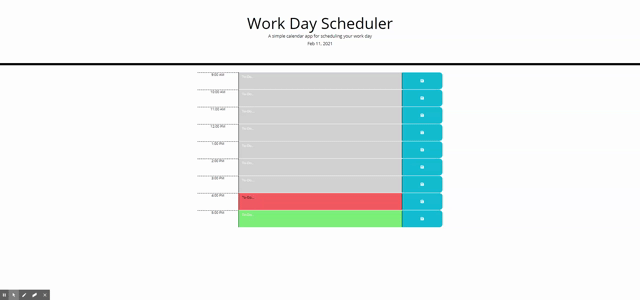

# 05-Third-Party-APIs-Assignment

## Links

* [Working Project](https://frank-merk.github.io/05-Third-Party-APIs-Assignment/)  
* [Luxon](https://moment.github.io/luxon/index.html)  

## Technologies used

* Luxon (similar to moment.js)
* JavaScript
* HTML
* CSS
* jQuery

## Description

This week's homework assignment was to create a simple calendar application that allows a user to save events for each hour of the day by modifying starter code, powered by HTML, CSS, jQuery, and a third party time-keeping API. The user should see the current date, and a calendar time-block with inputs for scheduling each hour. Those elements should be dynamically styled relative to the current time of day. The original project called to use moment.js, but I chose to use another recommended platform, luxon. 

## Images and Demo

  
## Strategy

First I had to dig through luxon's documentation to figure out how to the information I needed. I did a lot of experimenting and console logging to make sure I was getting the right info I needed to build the project. Then, I created my rough layout in the html file using bootstrap grid and buttons/icons, giving certain elements IDs and classes I could reference in the js file. I realize I could have dynamically populated these from the js file, but I preferred this method because I could preview my bootstrap content layout first before getting pulled into debugging javascript.

The script for this file gets the local time using the luxon API (DateTime = luxon.DateTime; dt = DateTime.local), and then we parse out that object to get live time data and convert into strings and numbers to use in our html and our functions. I needed the current day to display and the current hour as a class reference for the time blocks. Then, I referenced my timeblock elements using jquery, created variables to get local storage (that we set in a function) and used any data in local storage to populate those timeblocks when necessary.

The getTime() function uses the current hour to run through the time blocks and compare their IDs (integers) that we compare to the current hour hour integer. Conditionals determine what class the time block gets based on the ids relation to the current hour. Then, there's a click function for all the save icons with "saveBtn" class. When that button is cliked, it stores the value data from the to-do textarea to local storage. 

## License

Copyright 2021 Frank Merchlewitz

Permission is hereby granted, free of charge, to any person obtaining a copy of this software and associated documentation files (the "Software"), to deal in the Software without restriction, including without limitation the rights to use, copy, modify, merge, publish, distribute, sublicense, and/or sell copies of the Software, and to permit persons to whom the Software is furnished to do so, subject to the following conditions:

The above copyright notice and this permission notice shall be included in all copies or substantial portions of the Software.

THE SOFTWARE IS PROVIDED "AS IS", WITHOUT WARRANTY OF ANY KIND, EXPRESS OR IMPLIED, INCLUDING BUT NOT LIMITED TO THE WARRANTIES OF MERCHANTABILITY, FITNESS FOR A PARTICULAR PURPOSE AND NONINFRINGEMENT. IN NO EVENT SHALL THE AUTHORS OR COPYRIGHT HOLDERS BE LIABLE FOR ANY CLAIM, DAMAGES OR OTHER LIABILITY, WHETHER IN AN ACTION OF CONTRACT, TORT OR OTHERWISE, ARISING FROM, OUT OF OR IN CONNECTION WITH THE SOFTWARE OR THE USE OR OTHER DEALINGS IN THE SOFTWARE.
